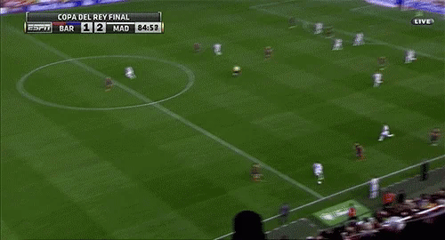

  
  

<!-- Stats snapshots refresh every 3 days via .github/workflows/update-stats.yml.
     Sources (7d Vercel edge cache):
     https://rajat-grs.vercel.app/api?username=wthrajat&show_icons=true&include_all_commits=true&hide=stars,issues&theme=dark&cache_seconds=604800
     https://rajat-grs.vercel.app/api?username=wthrajat&show_icons=true&include_all_commits=true&hide=stars,issues&theme=default&cache_seconds=604800
-->

  

  

